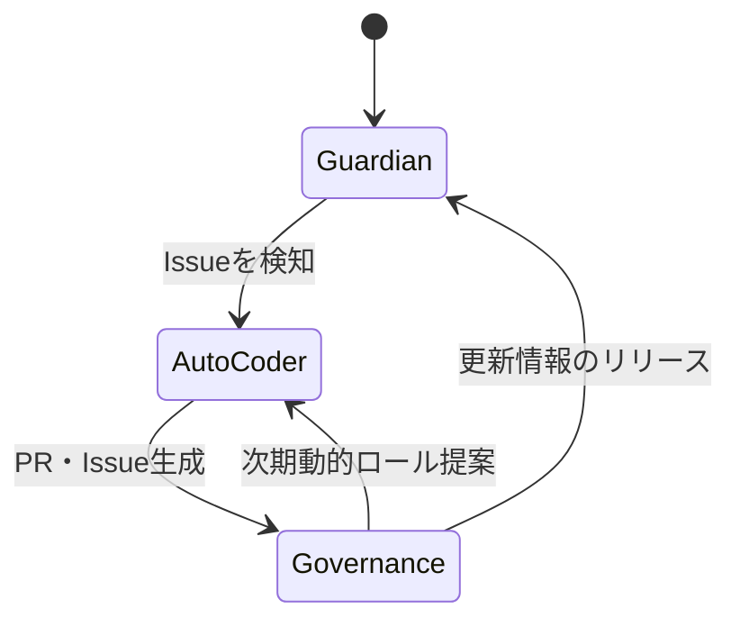

# ACE（Autonomous Colony Engine）

> 29 自動化ワークフロー ― 10 動的ロール ― 25 645 行のコード  
> 24時間動作する自律進化エンジン、完全自己修復を実現。

---

## ACEとは

ACEは、ScreepsのAIクラスタを完全に自律化し、自己診断、自己修復、そしてスマートガバナンスを一元化したフレームワークです。  
「自律進化・自己修復」を核に、外部の変更（PR・Issue）を感知し、検証・修正・統合を自動で完結させます。プロジェクトが成長するたびに、最適化される自己改造エンジン ― それがACEの本質です。

---

## システムアーキテクチャ（詳細）

三位一体のループが、日々ACEを進化させます。

1. **Guardian（監視）** – 継続的なセキュリティスキャン、ユニットテスト、カバレッジチェックを実行。問題が検知され次第Issueを自動生成します。  
2. **Auto‑Coder（修復）** – 生成されたIssueを解析し、コード補完・テスト生成・自動マージを行います。コンフリクトはAIが解決、PRは自動で作成・レビュー。  
3. **Governance（統治）** – README/CHANGELOGをリアルタイム更新し、不要ブランチをクリーンアップ、そして次期動的ロールを提案。プロジェクト構成を最適化します。  

以下はそのフローをMermaidで表したものです。

---

## コアテクノロジー

| コンポーネント | 主な機能 | 技術的要素 |
|----------------|----------|------------|