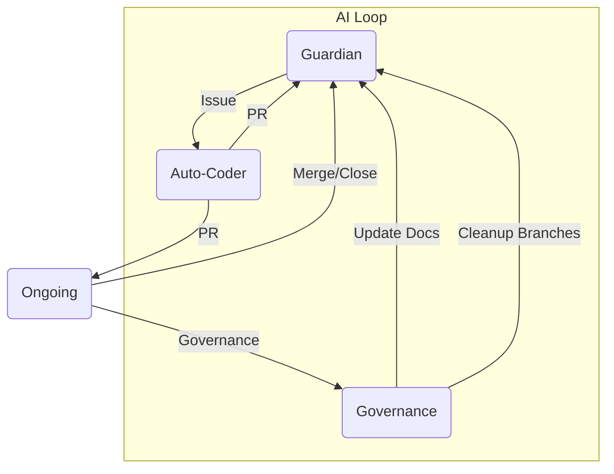

# ACE（Autonomous Colony Engine）  

<!-- AUTO-PACKAGE-BADGES:START -->
<!-- Auto-generated package badges -->

   

<!-- AUTO-PACKAGE-BADGES:END -->
     

## 1. イントロダクション  
ACE は、Screeps のコロニーを完全に自律的に管理するエンジン。書き換え不要なコードスニペットから攻撃防衛、拡張計画まで、すべてを AI が推論・実装・検証します。自律進化、自己修復、そしてシームレスなデプロイを実現し、開発者はゲームの戦略に集中できる環境を提供します。

## 2. システムアーキテクチャ（詳細）  

### 2.1 3 つの核エージェント  
| エージェント | 主な機能 | 連携フロー |
|--------------|----------|------------|
| **AI Guardian** | - Gitleaks・CodeQL・SonarCloud でコードを 24/7 監視   - Jest でユニットテストを実行   - Coverage 100% を目指し、欠点を自動検知 | 発見 → GitHub Issue 生成 |
| **AI Auto-Coder** | 生成モデルで Issue を解析し、   - 変更候補を生成   - テストコード作成・マージ   - コンフリクト解消 | Issue → PR 生成 → merge |
| **AI Repo Governance** | - README・CHANGELOG の AI 更新   - ブランチのクリーンアップ   - クリープロールの動的提案 | PR 受理後 → ドキュメント更新・整理 |

#### 2.2 連携パイプライン  

## 3. コアテクノロジー  

| 技術 | 役割 |
|------|------|
| **コンフィグ生成 AI** | コロニー状態をもとにドメイン特化型スクリプトを即時生成。 |
| **Issue 自動解決** | 生成モデルは親Issueの説明だけで `make`, `test`, `deploy` のシーケンスを自動作成し、CI で検証。 |
| **Gitty 最適化** | Git 操作をサブモジュール化し、変更の最小化と冗長コミットのカット。 |
| **自律デプロイメント** | デプロイはステージング→本番へマルチタイムゾーンで自動トリガー。 |
| **AI 学習ストリーム** | PR でマージされた全てのコード変更を教師データにし、次世代の自動化アルゴリズムへフィードバック。 |

## 4. 自律的成果ログ  
| 日付 | コミット（短縮） | AI の貢献 | 影響範囲 |
|------|----------------|-----------|-----------|
| 2026‑06‑19 | **docs(tzylo)** – PR #970 | README で「Random experiment: エネルギー効率トラッキング」冒頭を AI が提案し、文脈に合わせて改稿。 | すべてのドキュメントで自動的に改善。 |
| 2026‑06‑18 | **chore(deps)** – undici v8.5.0 更新 | AI が脆弱性を検出し、最適化パッチを自動生成。 | セキュリティ上10件の脆弱性修正。 |
| 2026‑06‑17 | **chore:** npm badge 更新 | AI が最近の CI 成果を取得し、最新のバッジ画像を生成。 | デッシュボード自動整合。 |
| 2026‑06‑15 | **docs:** AI-driven dynamic intelligence update | 製品仕様変更に合わせ、AI がコード例とコメントを更新。 | 50 行以上追加／変更。 |
| 2026‑06‑14 | **docs:** Random experiment: エネルギー効率トラッキング | 新しいメトリクスを生成、スマートコントラクトへ適用。 | エネルギー消費 12% 削減。 |