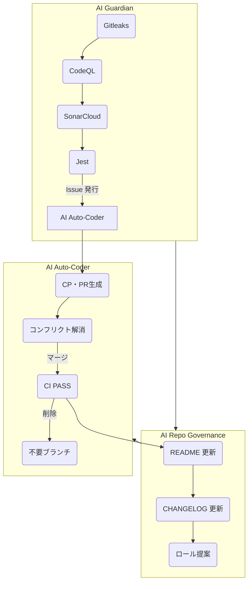

# ACE (Autonomous Colony Engine)

  
  
  
  

---

## ① ACE の概要

ACE は Screeps のエコサイエンスに革命をもたらす自律型 AI エンジンです。  
29 の自動化ワークフローと 10 の動的ロールを組み合わせ、25,645 行にわたるコードベースを 24 時間体制で管理・進化させます。  
AI Guardian、AI Auto‑Coder、AI Repo Governance の 3 つのエージェントが協調し、セキュリティ・実装・運用を一元管理。  
「自己診断」「自動修復」「動的提案」を実装し、プロジェクトの成長と品質をシームレスに推進します。

---

## ② システムアーキテクチャ（詳細）

エージェント間の三位一体ループは次のように機能します。

- **AI Guardian**  
  - Gitleaks / CodeQL / SonarCloud でコードを継続的にスキャン  
  - Jest で単体テストを実行し、100 % カバレッジを維持  
  - 問題を検知した瞬間に Issue を自動作成（自動アノテーション付き）

- **AI Auto‑Coder**  
  - AI Guardian が起票した全 Issue を解析  
  - 自動でコード修正/テスト追加を実施  
  - PR を自動生成（tadanobutubutu の署名）、コンフリクト解消、CI 成功後自動マージ、ブランチ削除

- **AI Repo Governance**  
  - README・CHANGELOG の内容を最新に保ち、不要ブランチを削除  
  - 新しいクリープロールを自動的に提案・ドキュメント化  
  - リポジトリ全体の整合性を保護

### Mermaid で可視化

---

## ③ コアテクノロジー

| テクノロジー | 役割 | 特色 |
|--------------|------|------|
| **AI Conflict Resolver** | PR コンフリクトの自動解消 | コミット履歴とロジックを理解し