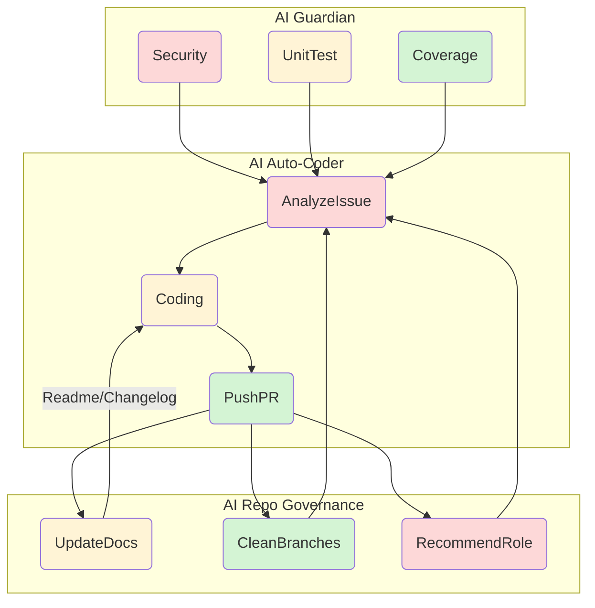

# ACE (Autonomous Colony Engine)  
  
  
  
  

---  

## 概要  
ACE は、Screeps における基地管理を完全に自律化し、自己修復・進化を実現する次世代エンジンです。  
- **統計**  
  - 自動化ワークフロー: 29  
  - 動的ロール: 10  
  - コード行数: 25,645  
- **主な特徴**  
  - 24 時間体制で安全監視とテスト実行  
  - AI が Issue を自動解析・解決  
  - GitHub 上でプルリクエストを自動生成・マージ  
  - ランタイム時に動的に最適化されたクリープロールを提案  

---

## システムアーキテクチャ (詳細)  
ACE の三位一体ループは、以下の三エージェントによって構成されます  

1. **AI Guardian** – セキュリティ・テスト・カバレッジを監視  
2. **AI Auto‑Coder** – Issue を解析し修正・テスト・PR を生成  
3. **AI Repo Governance** – README・CHANGELOG 更新、不要ブランチ整理・新ロール提案  

---  

## コアテクノロジー  
### AI Conflict Resolver  
- **GitMerge AI**：マージコンフリクトを検出し、PR の `--no-merge` フラグで回避。  
- **DiffGPT**：コード差分を解析して最適解を提案し、プルリクを自動生成。  

### Issue 自動解決  
- **MetaLinguist**：Issue の自然言語を解析し、適切なラベルとロボット応答を付与。  
- **CI‑Launchpad**：自動テストを瞬時に再実行し、失敗したケースを再試行。  

### GitHub 最適化 README  
- **ReadmeGen**：ローカルのコードベースとコミット履歴を元に、動的に書式化された README を生成。  
- **BadgeSync**：CI から最新のビルド・カバレッジ情報を取得し、バッ