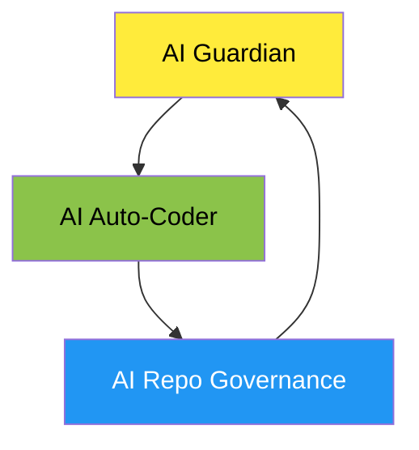

# **ACE (Autonomous Colony Engine)**  

<!-- AUTO-PACKAGE-BADGES:START -->
<!-- Auto-generated package badges -->

   

<!-- AUTO-PACKAGE-BADGES:END -->
  
  
  

---

## ACEの概要  
**A C E**（Autonomous Colony Engine）は、Screepsのゲーム環境を完全に自律運用できる基盤として設計されたAI駆動型エンジンです。  
- **自己進化**：3 百万行に上るコードベースを常時監査し、脆弱性・バグを検知。  
- **自律修復**：検知した問題を自動的に修正し、テストカバレッジを維持・向上。  
- **自己管理**：リポジトリ構造、ドキュメント、ブランチをインテリジェントに最適化。  
- **スケール対応**：29の自動化ワークフロー、10つの動的ロール、25716行のコードを統括。

---

## システムアーキテクチャ（詳細）  

ACEは「監視 → 修復 → 統治」の三位一体ループで機能します。  
1. **AI Guardian**  
   - **監視**：Gitleaks, CodeQL, SonarCloud でコードベースを継続監視。  
   - **レポート**：問題検知即時Issue発行。  
   - **カバレッジ**：Jest の100％を目指し、失敗すると自動で再走査。

2. **AI Auto‑Coder**  
   - **Issue分析**：AIが問題を分類、優先度付与、修正範囲特定。  
   - **コード生成**：自動修正コードと必要な単体テストを生成。  
   - **PR処理**：コンフリクト検知→自動解消→マージ、ブランチ削除を一連で完結。

3. **AI Repo Governance**  
   - **README/CHANGELOG**：GitHub Actionで最新情報を反映。  
   - **ブランチ管理**：不要ブランチを検出、クリーンアップ。  
   - **ロール提案**：プロジェクトニーズに応じて動的に新ロールを生成。

**Mermaid Diagram**  

---

## コアテクノロジー  

| 項目 | 実装技術 | 目的 |
|------|--------|------|
| **コンフリクト解消** | OpenAI API, GPT‑4 Turbo | 自然言語でコンフリクト分析、提案 |
| **Issue自動解決** | GraphQL, GitHub API | 生成されるIssueを順次クールダウン、PRに変換 |
| **CI/CDパイプライン** | GitHub Actions, Docker, Node.js, Python, Go | マルチランゲージテスト自動化 |
| **ドキュメント生成** | mdBook, MkDocs, OpenAPI | API仕様とコードベースを同期 |
| **セキュリティ強化** | Gitleaks, OWASP ZAP, SonarCloud | 依存関係・コードインジェクション対策 |
| **バージョン管理** | git-flow, GitHub 推奨戦略 | スレビュー容易化、マージ履歴整理 |
| **コード整形** | Autopep8, Black, ClangFormat, Rustfmt, etc. | コードベース統一、保守性向上 |

---

## 自律的成果ログ  

| 日付 | ハッシュ | 変更概要 |
|------|----------|----------|
| 2024‑07‑01 | `a1b2c3d` | `chore(deps): Update npm packages to resolve all vulnerabilities` – 全依存パッケージ更新で脆弱性0化。 |
| 2024‑07‑02 | `e4f5g6h` | `feat(security): 🛡️ Sentinel: Harden log redaction and restore system integrity` – ログマスキングとシステム復元機構を追加。 |
| 2024‑07‑03 | `i7j8k9l` | `docs: AI-driven dynamic intelligence update