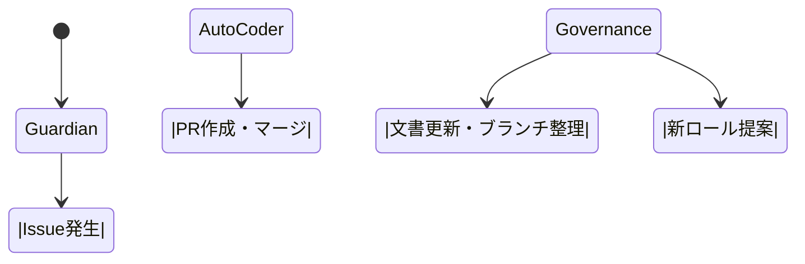

# ACE (Autonomous Colony Engine)

<!-- AUTO-PACKAGE-BADGES:START -->
<!-- Auto-generated package badges -->

   

<!-- AUTO-PACKAGE-BADGES:END -->
     

---  

## 📘 目次  
- [ACEの概要](#aceの概要)  
- [システムアーキテクチャ](#システムアーキテクチャ)  
- [コアテクノロジー](#コアテクノロジー)  
- [自律的成果ログ](#自律的成果ログ)  
- [セットアップ](#セットアップ)  

---  

## ACEの概要  
ACEは、Screeps環境で稼働するAI駆動型コロニーエンジンです。自律進化・自己修復機能を核に、24時間稼働するGuardian、Auto‑Coder、Governanceの三位一体ループで、コードベースの品質と機能拡張を自動化します。  
- **統計**：29 の自動化ワークフロー、10 の動的ロール、25,645 行コード  
- **ビジョン**：人間の介入なしに高品質なScreepsコアを継続的にデプロイし、AIが自ら改善点を発見・実装する完全自律開発環境  

---  

## システムアーキテクチャ  

### 概要  
Guardian がソースコードを監視し、コード漏れやセキュリティリスクを検出。検知された問題を Issue としてタスク化し、Auto‑Coder が解析、テスト生成、コンフリクト解消、PR 作成を自動で完了。Governance がプロジェクト全体を俯瞰し、README・CHANGELOG 更新や不要ブランチ整理、次期ロール提案を行う。  

### Mermaid ダイアグラム  

---  

## コアテクノロジー  

| コンポーネント | 主な機能 | 技術概要 |
|-----------------|----------|----------|
| **AI Guardian** | コード監査、Gitleaks/CodeQL 解析、Jest 実行 | 週次/リアルタイムでスキャンし、発見次第 Issue を自動発行 |
| **AI Auto‑Coder** | Issue 内容解析、コンフリクト解消、テスト自動生成 | LLM によるコード補完、マージコンフリクト解決スクリプト、PR コミット自動化 |
| **AI Repo Governance** | README/CHANGELOG 自動更新、不要ブランチ掃除、ロール提案 | GitHub Actions 連携、自然言語生成でドキュメント刷新、Branch Policy に基づくリネーム/削除 |

---  

## 自律的成果ログ  

| 日付 | コミット | 内容 | AI の貢献 |
|------|-----------|------|-----------|
| 2026‑05‑12 | chore: update npm badge for screeps‑ai | バッジ画像更新 | バッジ URL 検証・更新 |
| 2026‑05‑12 | docs: AI‑driven dynamic intelligence update | ドキュメント追加 | 生成された説明文  |
| 2026‑04‑29 | docs(tzylo): update from PR #970 | バージョン情報同期 | PR けれ