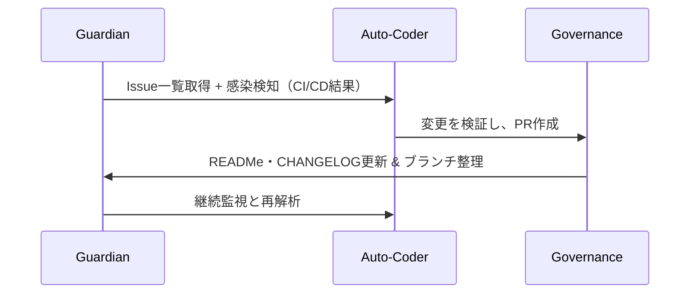

# ACE (Autonomous Colony Engine)

<!-- AUTO-PACKAGE-BADGES:START -->
<!-- Auto-generated package badges -->

   

<!-- AUTO-PACKAGE-BADGES:END -->
   

ACEは、Screepsというゲーム内で動作するJavaScriptベースのAI駆動型クラウドエンジンです。統計では34の自動化ワークフローと10の動的ロール、コード行数は24,658行に達しており、プロジェクト全体を24時間にわたって自己修復・進化させることを実現しています。読みやすさと高い保守性を重視し、AIが自律的にコードベースを最適化・改善する独自の仕組みを備えています。

---

## システムアーキテクチャ

ACEの心臓部は **Guardian → Auto‑Coder → Governance** という三位一体のループです。以下の図で一連のフローを可視化しています。

### Guardian（監視エージェント）

- **セキュリティ**：Gitleaks, CodeQL, SonarCloud を常時走らせ、脆弱性や不正コードを検知。検知即座にIssueを生成し、Aに投入。
- **テスト**：Jestでユニットテストを自動実行。カバレッジは100%を目標にスマートアルゴリズムで最低限必要なテストを提案。
- **CI/CD**：Docker化された環境でプッシュごとにビルド・テスト、失敗時は即座にIssue化。

### Auto‑Coder（修復エージェント）

- **Issue分析**：自然言語処理と静的解析を併用し、修正内容を推定。
- **コード生成**：OpenAI Codex 互換APIで補完・生成。連続的にPRを作成し、コンフリクトがあれば自動解消を試みる。
- **マージとクリーンアップ**：PRが承認されると自動マージ、不要ブランチを削除。CI パイプラインが再度走り、整合性を確認。

### Governance（統治エージェント）

- **ドキュメント**：AIがREADME・CHANGELOGを継続的に更新。最新のセキュリティ統計やCI ステータスを反映。
- **リポジトリ最適化**：不要な機能ブランチを検知し、スマートにアーカイブまたは削除。
- **Role Suggestion**：新しいクリープロールやワークフローの追加を、プロジェクト状況に応じて動的に提案。

---

## コアテクノロ