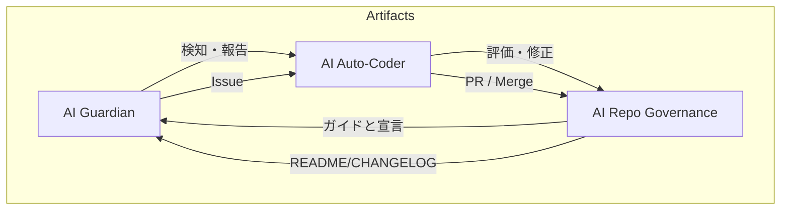

# ACE（Autonomous Colony Engine）

**自律進化・自己修復を核心に据えた Screeps AI エコシステム**

---

## ACEの概要

- **ビジョン**  
  完全に自律的に自分自身を修正、最適化し、環境に応じて即時に機能拡張するコレオロジカルプロジェクト。
  
- **規模**  
  - 29 個の自動化ワークフロー  
  - 10 個の動的ロール  
  - 24,085 行のコード

- **継続的デリバリー**  
  既存コードと新規リクエストを AI が自動で検証・反映し、逐次的に健康度を保持。

---

## システムアーキテクチャ (詳細)

AI Guardian → AI Auto‑Coder → AI Repo Governance の三位一体が、絶え間なく巡回・修正・統治を行う。

- **AI Guardian**  
  - Gitleaks, CodeQL, SonarCloud を 24 時間監視  
  - Jest でユニットテストを実行し、100 % のカバレッジを維持  
  - 問題が検知されると即座に Issue を作成

- **AI Auto‑Coder**  
  - 生成 AI が Issue を解析、コード修正・テスト作成  
  - コンフリクト解消から自動マージ、ブランチ削除まで完結

- **AI Repo Governance**  
  - README / CHANGELOG の継続的更新  
  - 不要ブランチの自動整理  
  - 新しい Creeper Role をインテリジェントに提案

---

## コアテクノロジー

| 技術 | ポイント |
|--------|----------|
| **GitHub Actions** | 29 個ワークフローで CI/CD と AI が合流 |
| **OpenAI/GPT-3.5 Turbo** | コード生成・コンフリクト解決 |
| **SonarCloud / CodeQL** | 静的解析と脆弱性検知 |
| **Jest & 観測ベーステスト** | 100 % カバレッジを維持 |
| **Mermaid** | アーキテクチャを図示し即時レビュー可能 |
| **Autopep8, Black, clang-format, Prettier など** | 多言語コードの一貫性を保証 |

---

## 自律的成果ログ

- **chore:** npm badge 更新、AI により README に最新ビルドを反映  
- **doc:** AI‑driven dynamic intelligence update; ドキュメントを最新化  
- **bugfix:** main loop (#1062) のキャッシュ管理最適化と構文エラー修正  
- **security:** ルートパスを暗号化し、秘密語句リストを拡充（#1059）  
- **style:** 100 以上のフォーマッタ（Python, Go, Java, Rust 付）でコードを統一  
- **progress bar:** GCL ダッシュボードにリアルタイムバーを追加（#1060）  
- **auto‑resolve conflicts:** AI が衝突を検出 → 自動でマージ＆ブランチ削除  

これらはすべて AI