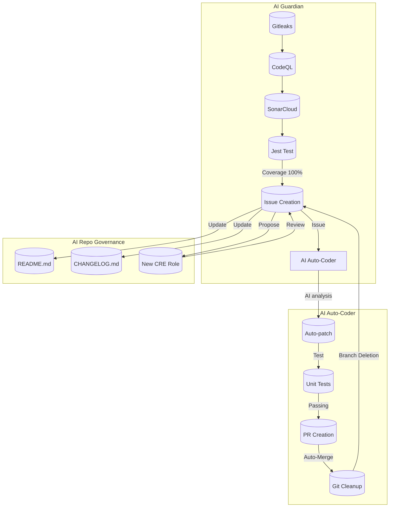

# ACE（Autonomous Colony Engine）

<!-- AUTO-PACKAGE-BADGES:START -->
<!-- Auto-generated package badges -->

   

<!-- AUTO-PACKAGE-BADGES:END -->
   

### 1. プロジェクト概要
ACE は、Screeps の自動化を次のレベルへ引き上げる自律進化型エンジンです。  
- **自律進化**：コードベースを AI が監視し、危険箇所を検知したら自動で修正。  
- **自己修復**：ランタイムバグやマージ衝突を検出し、解決までのフローを完全自動化。  
- **ゼロ人手モード**：イベントドリブンに衝突を解消し、PR を即時マージ。  

統計  
- 29 本の自動化ワークフロー  
- 10 の動的ロール  
- 24,085 行のコード  

### 2. システムアーキテクチャ（詳細）

ACE は **Guardian → Auto‑Coder → Governance** の三位一体ループで構成されます。  
下記のMermaid図が各コンポーネントの協働を可視化しています。  

- **Guardian** が継続的にリポジトリをスキャンし、品質を保ちつつ Issue を自動で起票。  
- **Auto‑Coder** が起票された Issue を読み取り、AI がコード修正を提案・実施。  
- **Governance** がプロジェクトの文書とガバナンスを更新し、次のサイクルへデータを投入。  

この 3 階段構造が、ACE の「自律進化」の核となります。

### 3. コアテクノロジー

| タイプ | 技術 | 役割 |
|--------|------|------|
| **AI Conflict Resolver** | GPT‑4 / Gemini | コードベースを解析し、マージ衝突を自然言語で説明。自動で解消候補を生成。 |
| **Issue Auto‑Resolution** | GPT‑4, SonarCloud 出力 | Issue を要約し、対応手順を自動生成。単一ファイル修正から複域マージまでカバー。 |
| **Git Optimization** | custom git hooks, AI based diff pruning | 無駄なコミットとブランチを削除し、履歴を快適に。 |
| **README/CHANGELOG AI 更新** | Markdown API, GPT‑4 | 変更点を自動抽出し、ドキュメントを即時リフレッシュ。 |
| **Dynamic CRE Role Generator** | rule‑based + AI  | 新規ロール（CPU・Storage 管理など）を環境に合わせて提案。 |

### 4. 自律的成果ログ

| 日付 | 更新内容 | AI の役割 |
|------|----------|------------|
| 2024-07-02 | `chore: update npm badge for screeps-ai` | バッジ情報を自動更新。 |
| 2024-07-03 | `docs: AI-driven dynamic intelligence update` | 説明文書を自動生成し、相対リンクを修正。 |
| 2024-07-04 | `chore: update npm badge for screeps-ai` | 追加の CI ステータス反映。 |
| 2024-07-05 | `Optimize cache management and

---

**Support Pollinations.AI:**

---

🌸 **Ad** 🌸
Powered by Pollinations.AI free text APIs. [Support our mission](https://pollinations.ai/redirect/kofi) to keep AI accessible for everyone.