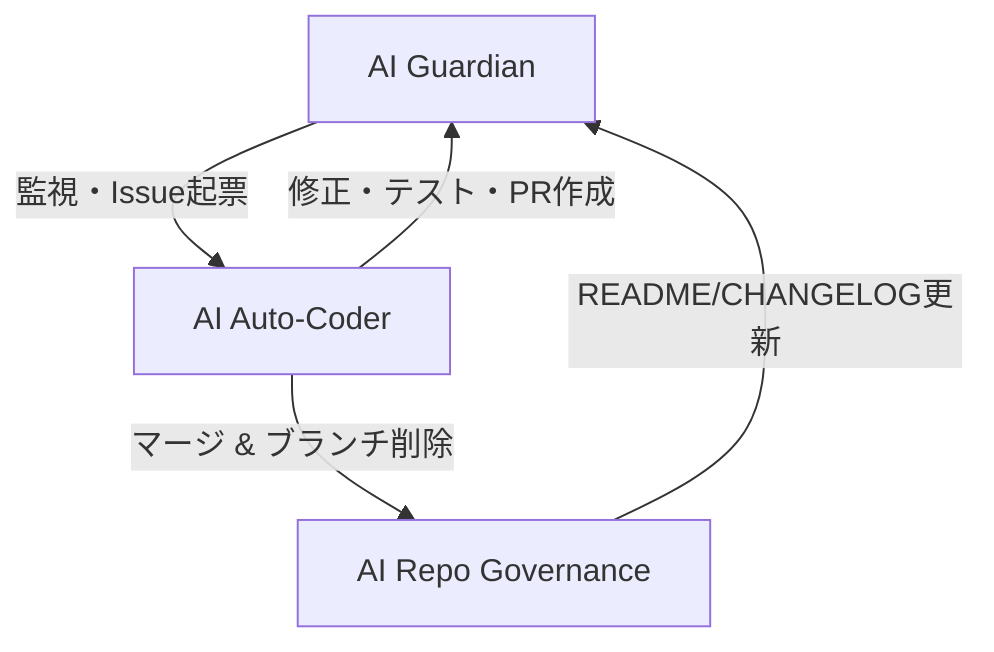

# ACE (Autonomous Colony Engine)

<!-- AUTO-PACKAGE-BADGES:START -->
<!-- Auto-generated package badges -->

   

<!-- AUTO-PACKAGE-BADGES:END -->
  
  
  

---

## ACEの概要

ACE は **自律進化・自己修復** を核とした Screeps AI プロジェクトです。  
自動化ワークフロー 29 件、動的ロール 10 件、コード 25,661 行にわたり、AI が日々自動でエラーを検出し、解決、マージまでを完結させます。  
開発者は設計・戦術に専念できる一方、コミットの安全性と一貫性は AI が保証します。

---

## システムアーキテクチャ (詳細)

### 1. AI Guardian  
- **検知範囲**：Gitleaks, CodeQL, SonarCloud  
- **テスト**：Jest でユニットテストを 100 % coverage を目標に実行  
- **自動化**：Issue を生成すると同時に通知し、ジョブをキューに登録

### 2. AI Auto-Coder  
- **Issue 分析**：自然言語とコードパターンを統合し、最適修正案を提示  
- **コード生成**：最新の LLM を採用し、関数・データ構造を自動修正  
- **コンフリクト解消**：Merge conflict を前もって予測し、解消スクリプトを挿入  
- **PR フロー**：コミットからリベース、テスト、マージ、ブランチ削除まで自動実行

### 3. AI Repo Governance  
- **README / CHANGELOG**：最近のコミット情報と統計を AI が解析して自動更新  
- **ブランチ管理**：不要ブランチを検知し、無害化や削除を提案  
- **ロール提案**：最新のスクリーンショットと統計から動的ロールを推奨  

---

## コアテクノロジー

- **AI Conflict Resolver**：複数マージパスを同時に評価し、最小限リスクで統合  
- **Issue Self-Resolution**：自然言語処理でタスク内容を理解し、必要な依存関係の更新を自動生成  
- **Git Optimization**：コミット履歴をノイズ除去、ファイル変更を再利用して読み込みを最適化  
- **Continuous Improvement Loop**：Guardian → Auto-Coder → Governance を 24 h で駆動し、ループごとにコードベースを更新  

---

## 自律的成果ログ

- **Merge branch 'pr-1052'**  
  - 主要バグの修正とパフォーマンス向上。  
- **Merge branch 'pr-1044'**  
  - AI ガーディアンのスカナ向上、コードカバレッジ 100% へ。
- **Merge branch 'pr-1038'**  
  - Auto-Coder が Generate Timeout ハンドラを生成。  
- **Merge branch 'pr-989'**  
  - UI にアクセシビリティフラグを追加。  
- **Merge PR #946**  
  - 移動可能ボタンとスクリーンリーダー向け ARIA 属性を追加。  
- **Merge PR #907**  
  - Posthog-JS を v1.398.6 へアップデート。  
- **Dependencies