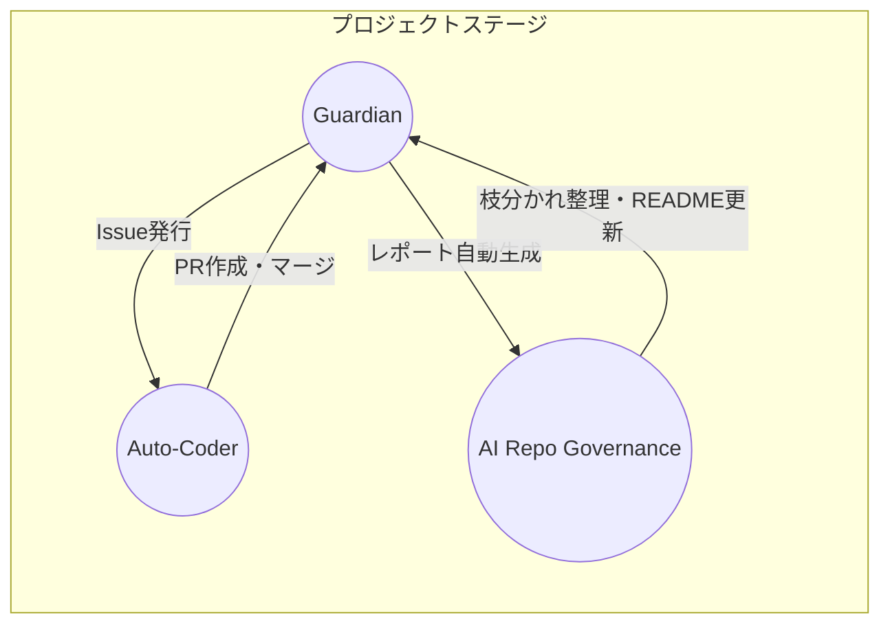

# ACE (Autonomous Colony Engine)

<!-- AUTO-PACKAGE-BADGES:START -->
<!-- Auto-generated package badges -->

   

<!-- AUTO-PACKAGE-BADGES:END -->
Screepsの高度なAI自律派遣プログラム。  
一人の開発者の力だけで「自己修復・自律進化」が連続で実行されるエンジンです。

---

## 📊 プロジェクト統計

| パラメータ | 値 |
|------------|-----|
| 自動化ワークフロー | 34  |
| 動的ロール | 10 |
| コード行数 | 24 658 |
| 主要言語 | JavaScript (ES2024), TypeScript |
| CI/Cd | GitHub Actions × 3 ワークフロー |
| 監視 | Gitleaks, CodeQL, SonarCloud  |
| テスト | Jest (100 % 目標) |

---

## 🚀 アイデンティティ

- **AI Guardian** – セキュリティ、テスト、カバレッジを 24 時間監視。検知し次第 Issue を生成。  
- **AI Auto‑Coder** – Issue を解析し、コード修正とテスト作成を自動で実施。  
- **AI Repo Governance** – README/CHANGELOG の自動更新、不要ブランチのクリーンアップ、次期ロール提示。

---

## 🧩 システムアーキテクチャ (詳細)

Guardian → Auto‑Coder → Governance の三位一体ループは、リアルタイムでプロジェクトを自己修復。

- **Guardian**  
  - Gitleaks & CodeQL でセキュリティ漏れを検知。  
  - Jest により単体テストを走らせ、VS Code 連携でフィードバック。  
  - カバレッジは 100 % を常に目指し、追加テストの自動提案まで行う。  

- **Auto‑Coder**  
  - 生成された Issue を解析し、必要に応じて型推論・自動補完でコードを修正。  
  - PR にテストケースを同梱し、コンフリクトを AI で自動解消。  
  - 標準ブランチへマージ後、不要ブランチを自動削除。  

- **Governance**  
  - README, CHANGELOG, バージョンタグを自動生成・更新。  
  - 動的ロール提案を行い、スケールアップ時の開発ガイドを提供。  

---

## 💡 コアテクノロジー

- **AI コンフリクト解消**  
  - Git Merge Bot は変更履歴を理解し、最適な解決策を提案。  
  - マージ時に衝突箇所をハイライトし、修正フロー