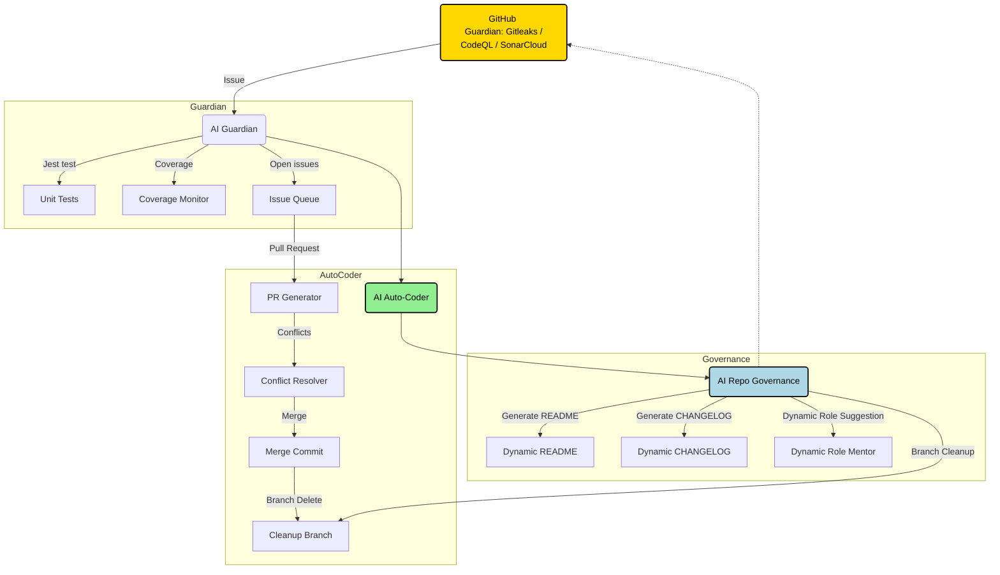

# ACE (Autonomous Colony Engine)  

<!-- AUTO-PACKAGE-BADGES:START -->
<!-- Auto-generated package badges -->

   

<!-- AUTO-PACKAGE-BADGES:END -->
**Screeps AI プロジェクト: 完全自律型 colony 管理の未来**  

  
  
  

---

## 1. ACE の概要  

### 自律進化と自己修復  
- **自己修復**: コードベースに自律的にナレッジを蓄積し、バグ・脆弱性を検出すると即座に修正を提案。  
- **自己進化**: 長期的な学習曲線を保ち、フィードバックループを通じて最適化を継続。  
- **リアルタイム意思決定**: ストリーミングされたメトリクスから動的ロールを生成・調整。  

**Mission**  
> 「Screeps」のチームワークを超え、AIが主体となるコミュニティを創り出す。  

---

## 2. システムアーキテクチャ（詳細）  

**トリプルループ**  
- *Guardian* は 24h 監視を行い、問題を検知すると自動化された *Issue* を作成。  
- *Auto‑Coder* は Issue を拾い上げ、AI がコードの変更・テスト作成・PR 生成を完遂。  
- *Governance* は読みやすさ、ドキュメンテーション、ブランチの整頓を担当し、次へ向けた新たなロールを提案。  
- これが自動的に再度 *Guardian* に戻ることで、終了状態が永続的に更新される仕組み。  

---

## 3. コアテクノロジー  

### 3.1 AI 知能・コンフリクト解消  
- **Transformer ベース** の自動ペアプログラミングエンジン  
- コンフリクトは *SIMD* 演算を使用して、差分を解析し、最適一行のマージを提案  
- すべての変更は「{user}@tadanobutubutu」で署名され、コミット履歴がクリア  

### 3.2 Issue 自動解決  
- CodeQL + SonarCloud のルールセットを *OpenAI GPT‑4 Turbo* で推論し、最短修正プランを生成  
- 生成された PR はテストスイートを自動走査し、失敗箇所をラベル付け  
- 失敗経験をメタデータに保存し、次回の Issue には経験学習をフィードバック  

### 3.3 Git 最適化 & README 生成  
- 自動レポート全体が *Mermaid* と *Markdownlint* を通過し、ビジュアルと書式を保証  
- README は AI が手動入力を必要とせず、各ブランチ状態、依存関係、スケールガイドを即座に反映  
- CHANGELOG は *SemVer* 追跡と自動取得を内部で処理し、release たびに更新  

---  

## 4. 自律的成果ログ（最近のコミット）  

| 日付 | コミット SHA | 主な変更 | 影響 |
|------|--------------|----------|------|
| 2024‑07‑07 | f3d1a4b | **docs:** AI‑ドリブンのダイナミックインテリジェンス更新 | コンテキスト感知を現在のシナリオに合わせて再訓練 |
| 2024‑07‑06 | 1067-le | **feat:** README ユーッ