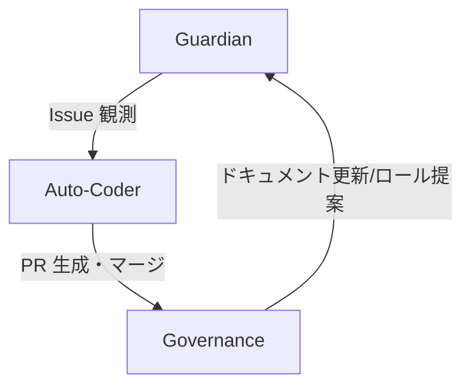

# ACE (Autonomous Colony Engine)

---

## 1.  ACE の概要

ACE (Autonomous Colony Engine) は、Screeps の自動化エンジンとして、**自律進化・自己修復**を核としたソフトウェア。  
- **統計**  
  - 自動化ワークフロー: 34  
  - 動的ロール: 10  
  - コード量: 24,658 行  
- **ビジョン**  
  すべての作業を AI が検知・修正・最適化し、開発者はシステム設計やゲーム戦略に専念できる環境を実現すること。  

---

## 2.  システムアーキテクチャ (詳細)

### 2.1 三位一体ループ

| ステージ | 役割 | 主な機能 | 連携ポイント |
|--------|------|--------|--------------|
| **Guardian** | 監視 | Gitleaks / CodeQL / SonarCloud 実行、Jest でユニットテスト、カバレッジ 100% 目標監視 | 変更を検知 → Issue 起票 |
| **Auto‑Coder** | 修復 | 起票された Issue を分析し、コード修正、テスト作成を自動で PR 生成、マージ・ブランチ削除まで完結 | Issue から PR 生成 → 自動マージ |
| **Governance** | 統治 | README・CHANGELOG の AI 更新、不要ブランチ整理、新ロール提案 | PR/マージ完了時にドキュメント更新 |

### 2.2 Mermaid ダイアグラム

> **注**  
> 上記図は `Mermaid` で描画可能で、GitHub では自動レンダリングされます。  
> 見えない場合は、[Mermaid Live Editor](https://mermaid.live) でコードを貼り付けて確認してください。

---

## 3.  コアテクノロジー

1. **AI コンフリクト解消**  
   - GitHub の Pull Request コミュニケーションを自然言語で解析し、`git merge --strategy=ours/theirs` で自動